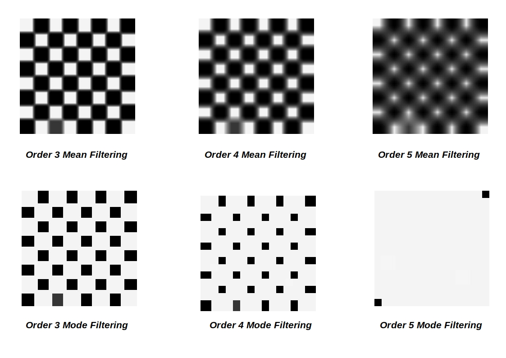
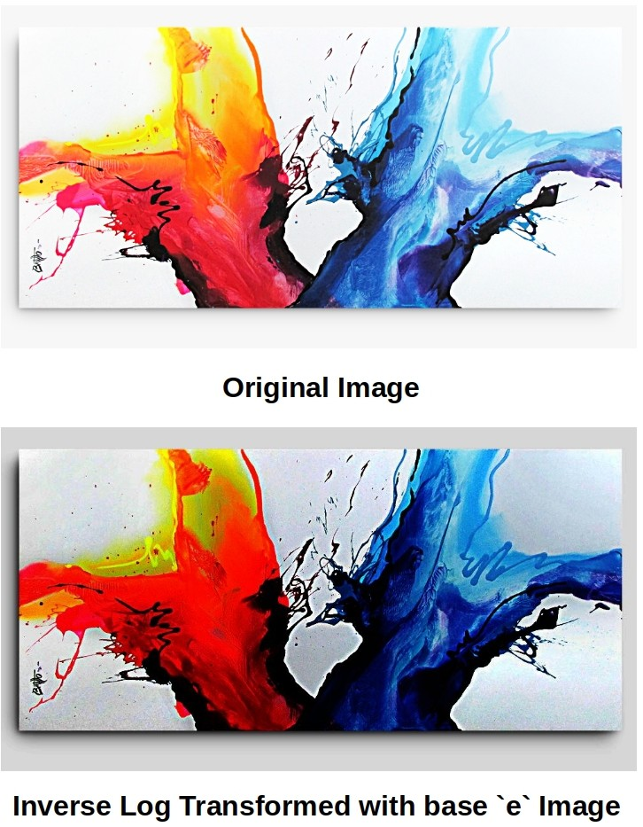
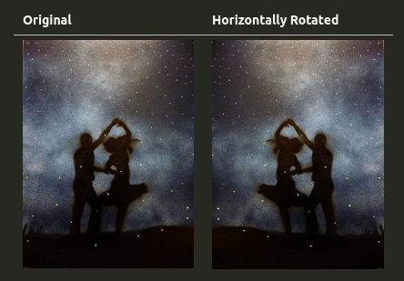

# filterIt



~~Another Order **n** _( >= 1 )_ Image Filtering implementation in Java.~~ **Show some** :heart:



**Not anymore just an image filtering implementation, rather I planned to extend it to also include pixel transformation & image rotation implementations _( where each of which is written from scratch )_**



**What's more interesting is, I'm converting all implementations into concurrent one, so that it can leverage power of modern multi-core machines** :wink:

_Help me in improving it :)_

## implementation(s)

### Spatial Filters

- [x] [Mean Filter](./docs/meanFilter.md)
- [x] [Median Filter](./docs/medianFilter.md)
- [x] [Mode Filter](./docs/modeFilter.md)
- [x] [Min Filter](./docs/minFilter.md)

### Edge Detection Filters

- [x] [Sobel Filter](./docs/sobelFilter.md)
- [x] [Prewitt Filter](./docs/prewittFilter.md)
- [ ] Laplacian Filter

### Gray Scaling

- [x] [Gray Scaling](./docs/grayscaling.md)

### Pixel Transformation _( Concurrency incorporated )_

- [x] [Inverse Transformation](./docs/inverseTransformation.md)
- [x] [Gamma Correction](./docs/gammaCorrection.md)
- [x] [Log Transformation](./docs/logTransformation.md)
- [x] [Inverse Log Transformation](./docs/inverseLogTransformation.md)
- [x] [Histogram Equalization](./docs/histogramEqualization.md)
- [x] [Contrast Stretching](./docs/contrastStretching.md)

### Image Transposition

- [x] [Transposed Image](./docs/transpose.md)

### Rotation _( Concurrency incorporated )_

- Basic Rotation
    - [x] [Horizontal Rotation](./docs/horizontalRotation.md)
    - [x] [Vertical Rotation](./docs/verticalRotation.md)
- Compound Rotation
    - [x] [Clockwise Rotation](./docs/clockwiseRotation.md)
    - [x] [Anti-Clockwise Rotation](./docs/antiClockwiseRotation.md)

### Arithmetic Operator(s)

- [x] [Addition](./docs/additionOp.md)
- [x] [Subtraction](./docs/subtractionOp.md)
- [ ] Multiplication
- [ ] Division
- [ ] Bitwise OR
- [ ] Bitwise AND
- [ ] Bitwise XOR

## API documentation

Check [here](https://itzmeanjan.github.io/filterIt/javadoc/)

## usage

- Make sure you've JDK installed on your machine. I've used `openjdk version "1.8.0_232-solus"`; check yours using

```bash
$ java -version
$ javac -version
```

- Clone this repo into your machine

```bash
$ git clone https://github.com/itzmeanjan/filterIt.git
```

- Get into `filterIt` directory

```bash
$ cd filterIt
```

- You'll see one bash script, named `compile`, execute it

```bash
$ ls compile
$ chmod +x compile # making it executable
$ ./compile # compiles all java source files & builds *.jar from it
$ ls in.itzmeanjan.filterit.jar # generated jar; holding compiled classes
```

- Now you've whole package compiled into a single jar _( not runnable itself )_, which can be put into any directory where you want to use this package

- Let's copy `in.itmeanjan.filterit.jar` to immediate parent directory; then move to parent directory & create a java source file.

```bash
$ cp in.itzmeanjan.filterit.jar ..
$ cd ..
$ touch Main.java
```

- Open `Main.java` using your favourite text editor & start by importing required classes for applying inverse image transformation on a given image.

```java
import in.itzmeanjan.filterit.ImportExportImage; // for reading & writing images
import in.itzmeanjan.filterit.transform.InverseImageTransformation; // implementation of inverse image transformation
```

- Start defining your class; write a main method, inside which we'll apply InverseImageTransformation on an image.

```java
import in.itzmeanjan.filterit.ImportExportImage;
import in.itzmeanjan.filterit.transform.InverseImageTransformation;

class Main {
    public static void main(String[] args) {
        InverseImageTransformation iTransformation = new InverseImageTransformation();
        // make sure you've x.jpg present in this directory
        // modified image to be stored in y.jpg, in same directory
        System.out.println(ImportExportImage.exportImage(iTransformation.transform("./x.jpg"), "./y.jpg"));
    }
}
```

- Compile & run it, while setting classpath to `in.itzmeanjan.filterit.jar` file

```bash
$ javac -cp ".:in.itzmeanjan.filterit.jar" Main.java
$ java -cp ".:in.itzmeanjan.filterit.jar" Main
```

- And you've your result in `y.jpg`
- Check out `javadoc` generated API documentation [here](https://itzmeanjan.github.io/filterIt/javadoc/)

## contribution

If you want to help me in improving this package, you're very much welcome. First fork this repo & then clone it into your machine. Now you can start working on it. Finally submit a PR :wink:

What I'm currently interested in is, implementing different pixel operations i.e. +, -, *, /, %, &, \|, ! etc. If you can help me in getting those implemented, that'll be great.


_Thanking you ..._
