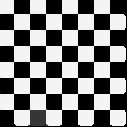

# filterIt


Another Order **n** _( >= 1 )_ Image Filtering implementation in Java. **Show some** :heart:

## usage

First clone this repo into a suitable directory in your computer

```bash
$ git clone https://github.com/itzmeanjan/filterIt.git
```

Make sure you've JDK _( >=8 )_ installed. Check using

```bash
$ javac -version
```

Time to compile Java classes

```bash
$ find . -name "*.java" | xargs javac
```

Now we can run it

```bash
$ java Driver sample.jpg 3 # generates each of mean, median & mode filtered images of order 1, 2, 3
```

Generated images will be in current working directory :wink:

## examples

### Spatial Filter(s)

Order | Mean | Median | Mode | Min
--- | --- | --- | --- | ---
0 |  |  |  | 
1 |  |  |  | 
2 |  |  |  | 
3 |  |  |  | 
4 |  |  |  | 
5 |  |  |  | 

### Edge Detection Filter(s)

Filter | Original | Horizontal Edges | Vertical Edges | Both Edges
--- | --- | --- | --- | ---
Sobel |  |  |  | 
Prewitt |  |  |  | 

### GrayScaling

Original | GrayScaled
--- | ---
 | 

### Inverse Pixel Transformation

Type | Original | GrayScaled
--- | --- | ---
Grayscaled |  | 
Color |  | 

**Thanking you ...**
