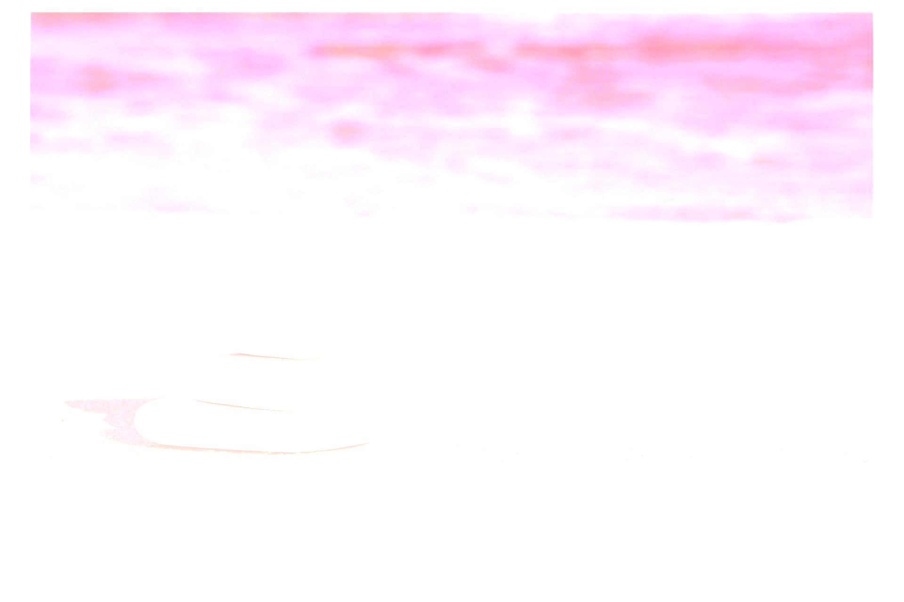
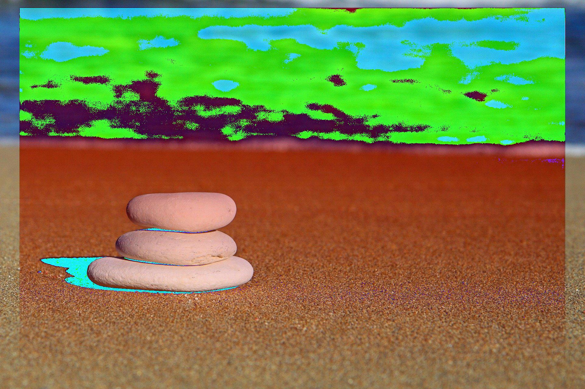

# Addition Operator

## Original Images ( Operands )

Image 1 | Image 2
--- | --- |
 | 

## Resulting Images = Image_1 + Image_2

It's pretty evident that after application of addition operator on two equal sized images, resulting pixel intensity values may be out of range _( > 255 )_, which can't be stored in a 24-bit RGB image. For putting pixel intensities in [0, 255] range, we can consider either of following two ways

- All pixel intensities < 0, becomes 0 and > 255, becomes 255. **[ Clipping ]**
- We'll simply apply modulus _( % )_ 256, to put all pixel intensities back to range. **[ Scaling ]**

Clipped | Scaled 
--- | ---
 | 
