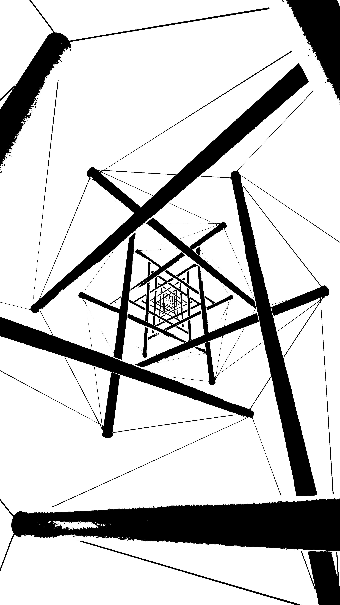

# Automatic Thresholding

## Introduction

Here we're going to segment one image 
_( with a bimodal histogram )_, using **Otsu's Algorithm**, which
tries to maximize inter class variance, by minimizing intra class
variance. Finally we obtain suitable intensity value 
_( to be used as threshold )_, for that intensity value which is having highest
inter class variance.

Pixel intensity classes are defined by selecting a threshold ∈ [0, 255]

- Intensity < threshold :> class one
- Intensity >= threshold :> class two

Details available [here](https://en.wikipedia.org/wiki/Otsu%27s_method).

## Usage

**Image to be segmented needs to be bi-modal, only then this algorithm performs well.**

- Make sure you've _JDK_ installed & added `in.itzmeanjan.filterit.jar` to your Java project.
- Now in `Main.java`, put following code snippet.

```java
// this is Main.java
// assuming weaver.jpg is present in current working 
// directory or put image file name as you wish

import in.itzmeanjan.filterit.ImportExportImage;
import in.itzmeanjan.filterit.segmentation.AutomaticThresholding;

public class Main {

    public static void main(String[] args) {
        AutomaticThresholding automaticThresholding = new AutomaticThresholding();
        System.out.println(
                ImportExportImage.exportImage(
                        automaticThresholding.segment("./weaver.jpg"),
                        "segmentedUsingAutomaticThresholding.jpg"));
    }
}
```

- Compile `Main.java` using following bash command.

```bash
$  javac -cp ".:in.itzmeanjan.filterit.jar" Main.java
```

- Run it with following command

```bash
$  java -cp ".:in.itzmeanjan.filterit.jar" Main
```

- And here's your result.

## Result

Original Image | Segmented Image
--- | ---
 | 
 | 

Thanking you :)
