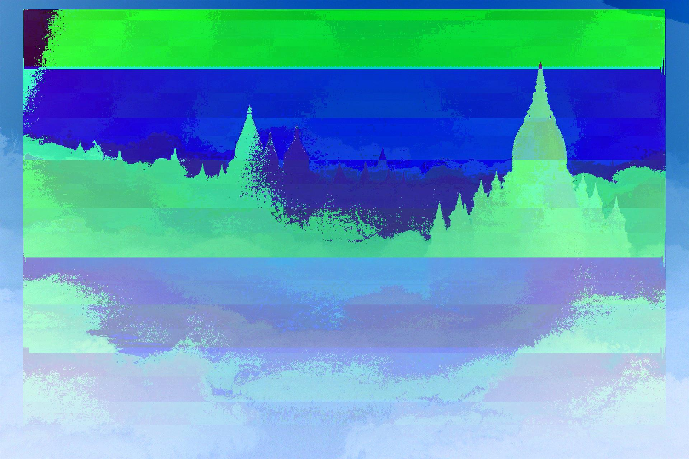

# Bitwise XOR Operation

## Introduction

So we're given with two images of equal dimension & asked to XOR them, **what do we do ?**

We'll go through each pixel P[x, y] on both images & perform bitwise XOR operation on their corresponding intensity values, and result to be stored at P[x, y] on sink image.

As we're also interested in supporting color images, we need to perform aforementioned XOR op 3 times _( for R, G & B color component )_ for each pixel location P[x, y].

### Truth Table for XOR

_**c = a ^ b**_

a | b | c
--- | --- | ---
0 | 0 | 0
0 | 1 | 1
1 | 0 | 1
1 | 1 | 0


## Usage

- `Main.java` in another project, where I'm leveraging _filterIt_.

```java
// Main.java
import in.itzmeanjan.filterit.ImportExportImage;
import in.itzmeanjan.filterit.bitwise.BitwiseXOR;

class Main{
    public static void main(String [] args){
        ImportExportImage.exportImage(
        new BitwiseXOR().operate("cloud.jpg", "white.jpg"),
        "bitwiseXORedOne.jpg");
    }
}
```

- Compilation & running

```bash
# in.itzmeanjan.filterit.jar & Main.java are present in same directory
$ javac -cp ".:in.itzmeanjan.filterit.jar" Main.java
$ java -cp ".:in.itzmeanjan.filterit.jar" Main
```

## Resulting Images

Image 1 | Image 2 | Image_1 ^ Image_2
--- | --- | ---
 |  | 
 |  | 

Thanking you, :blush:
