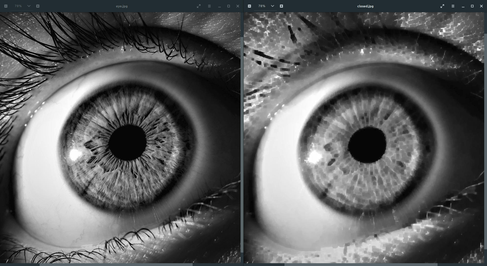
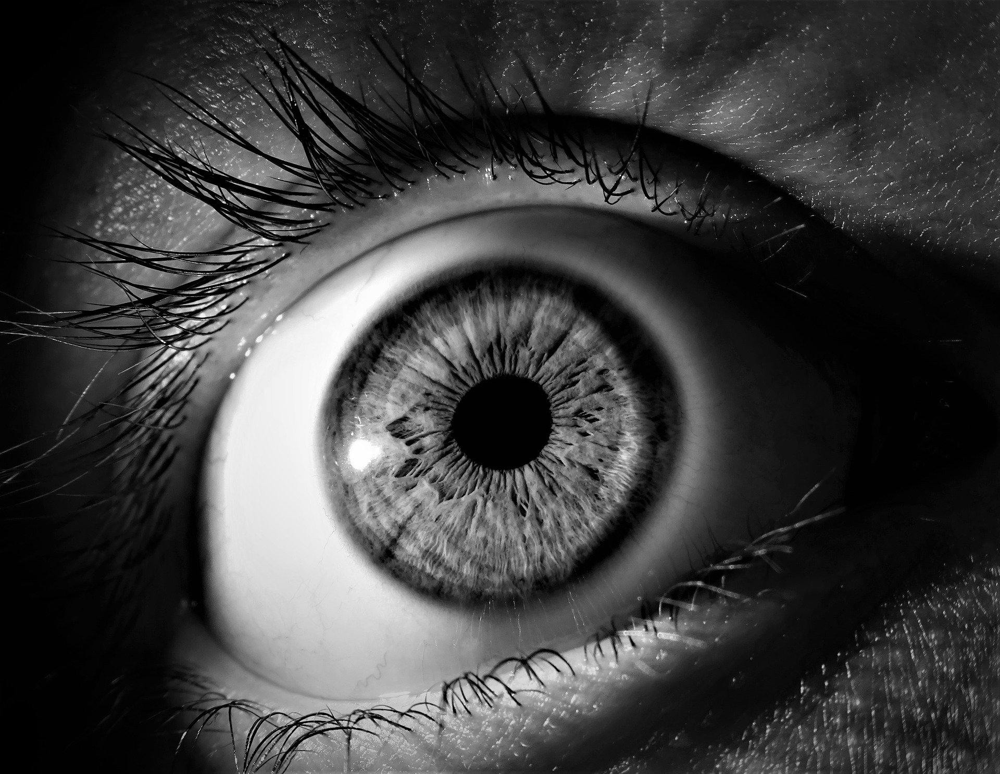

# Image Smoothing - Closing



## Introduction

Image smoothing can be performed by application of morphological operations in ordered fashion.

- First dilate image
- Then erode it

**Image gets smoothed by adding new bright pixels, here we're considering bright pixels to be our foreground pixels.**

Size of structuring element i.e. order of kernel to be used Dilation & Erosion,
can be specified, which will control extent of smoothing.

## Usage

- Put this code snippet into Java source file.

```java
import in.itzmeanjan.filterit.ImportExportImage;
import in.itzmeanjan.filterit.smoothing.Closing;

public class Main{

	public static void main(String [] args){
		System.out.println(
            ImportExportImage.exportImage(
                new Closing().smooth("eye.jpg", 5, 5), 
                "closed.jpg"));
	}

}
```

- Compile & run, make sure you've added `in.itzmeanjan.filterit.jar` as your project dependency.

## Result

Generated by applying **closing** operation on left one, while size of kernel for both dilation & erosion set to _11 x 11_ i.e. order of neighbourhood used **5**.

Original | Smoothed
--- | ---
 | 

Thanking you :)
