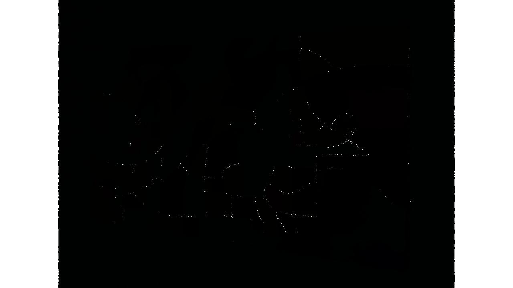
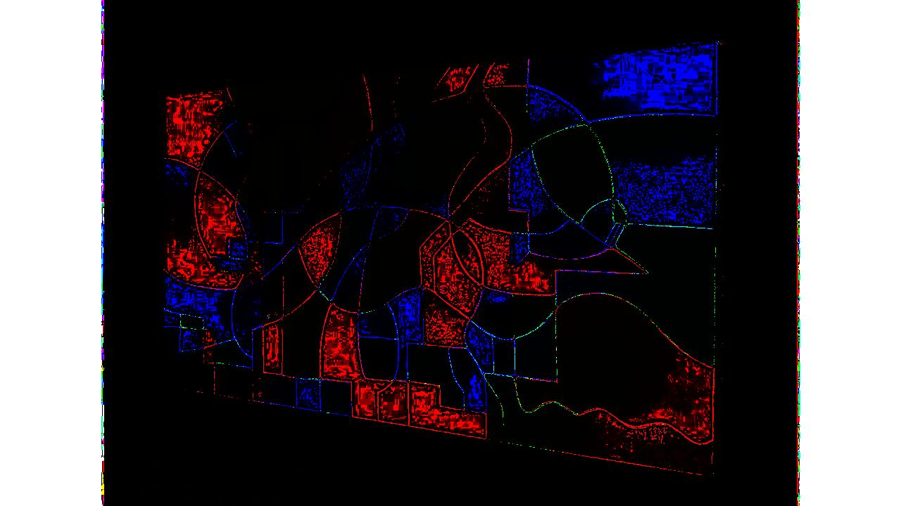

# Division Operator

## Original Images ( Operands )

Image 1 | Image 2
--- | --- |
 | 

## Resulting Images

Pixel intensities to be rounded after floating point division, _but if divisor's pixel intensity is **0**, then resulting pixel intensity to be made 255 ( highest possible pixel intensity value for color component in 8-bit image )_

If two images are passed, first one is _dividend_ & second one is _divisor_.

Image_1 / Image_2 | Image_2 / Image_1 
--- | ---
 | 
