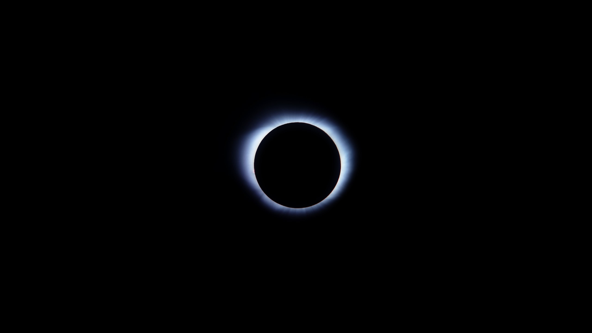

# Edge Detection using Erosion

## Introduction

Given an image with white foreground color & black background color,

- Gray scale given image, to be safe, if user given color image
- Erode image by applying erosion for one time
- Subtract the eroded image from gray scaled one, and you've edge detected image.

**Make sure, given image is having rgb(255, 255, 255) as foreground color, otherwise erosion will not work as expected, resulting into failed edge detection op.**

## Usage

- Code for edge detection using erosion as basic op.

```java
import in.itzmeanjan.filterit.ImportExportImage;
import in.itzmeanjan.filterit.edgedetection.EdgeDetectionUsingErosion;


public class Main{

	public static void main(String [] args){
		System.out.println(
            ImportExportImage.exportImage(
                new EdgeDetectionUsingErosion().detect("moon.jpg"),
                 "edgeDetected.jpg"));
	}

}
```

- Make sure you've downloaded `in.itzmeanjan.filterit.jar` & added it as project dependency.

## Result

Source | Edge Detected
--- | ---
 | 

Thanking you :blush:
