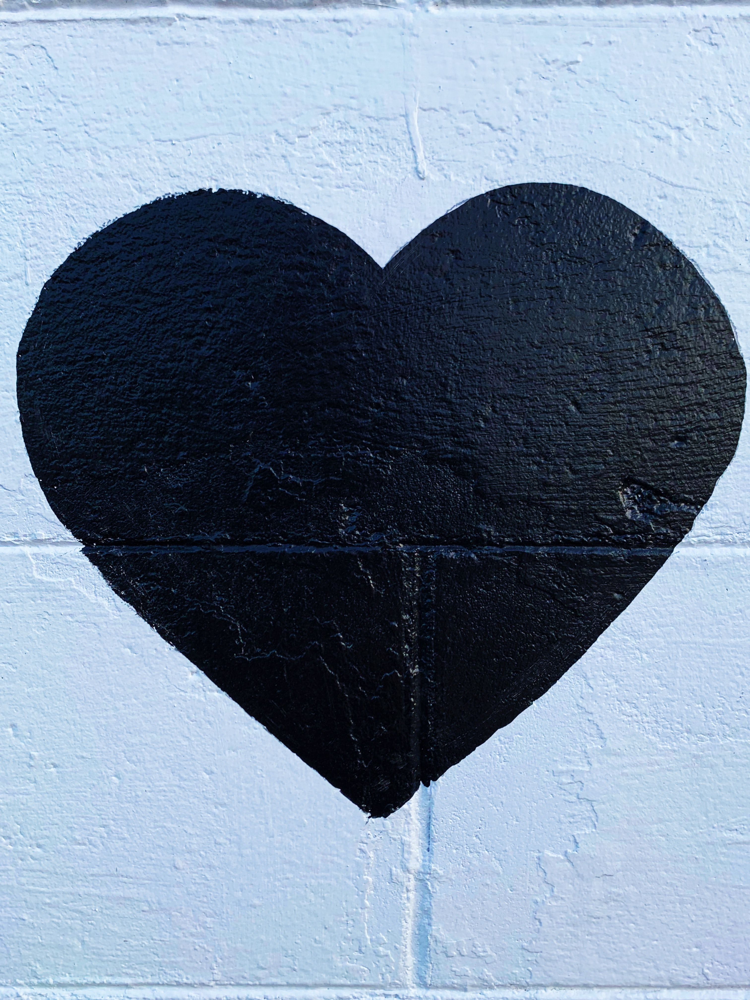
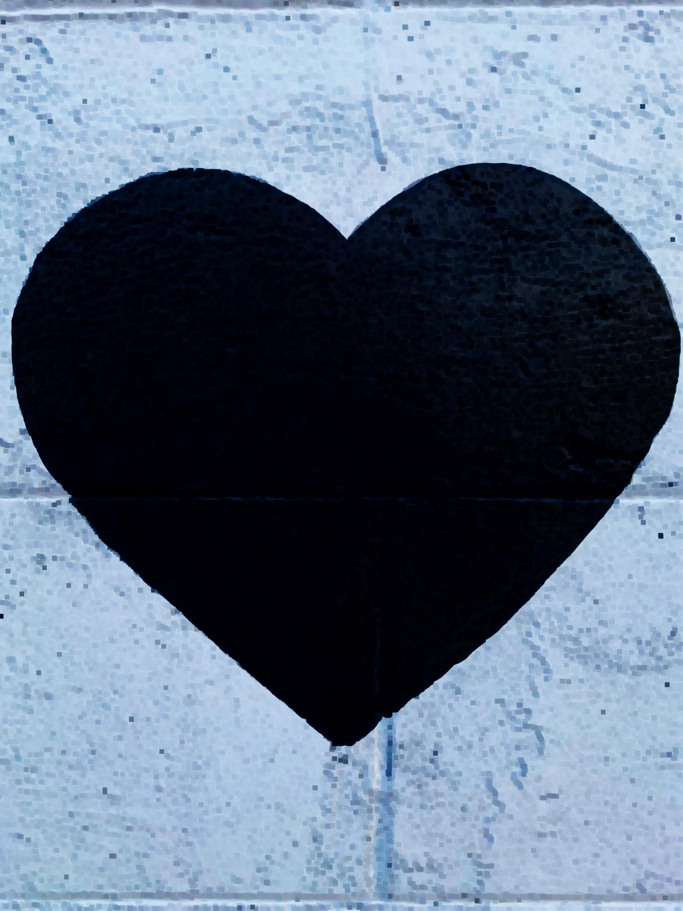

# Erosion - Image Morphological Operation

## Introduction

Given a binary image where foreground objects colored white & background objects in black,
we will apply a kernel of different possible shapes and / or sizes on each pixel of image, resulting into decreased foreground region of image i.e.
center pixel of mask/ kernel to be made white _( foreground pixel color )_ if and only if all pixels currently under mask are white too, otherwise
this pixel to be made black. Which will eventually lead to decreased size of foreground region.

But as we'll mostly likely be encountering grayscale & color images, we'll make simple modification in out Erosion op definition which is assume we're applying MinFilter on each pixel of image with just an exception in shape & size of structuring element, which I've been addressing as mask/ kernel so far.

Though current implementation of `Erosion` doesn't support any shape other than square shaped mask.

## Usage

- Add following code snippet in Java source file.

```java
import in.itzmeanjan.filterit.ImportExportImage;
import in.itzmeanjan.filterit.morphology.Erosion;


public class Main{

	public static void main(String [] args){
		System.out.println(
            ImportExportImage.exportImage(
                new Erosion().erode("love.jpg", 3, 3), 
                "eroded.jpg"));
	}

}
```

- Compile & run project, make sure you've added `in.itzmeanjan.filterit.jar` in your project as dependency.

## Result

Effectiveness of any morphological op depends upon shape of structuring element being used & number of iterations its applied on image.
I've applied it 3 times, while taking a square shaped mask of size _7 x 7_.

See, eroded image is having more background pixels _( i.e. black = rgb(0, 0, 0) )_ than original one.

Source | Eroded 
--- | ---
 | 


Thanking you :)
