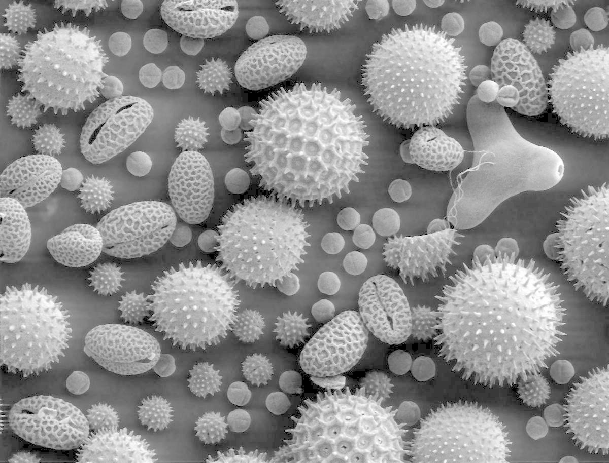
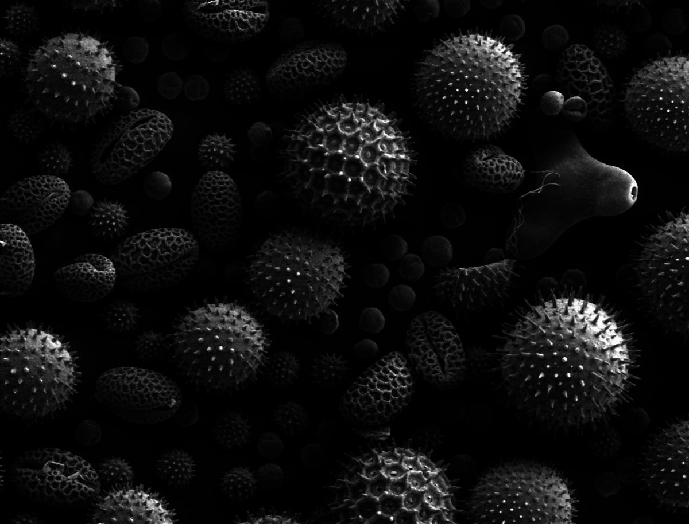

# Gamma Correction

Type | γ | Original | Gamma Corrected
--- | --- | --- | ---
Grayscaled | 1/2 |  | 
Grayscaled | 1/3 |  | 
Grayscaled | 2 |  | 
Grayscaled | 3 |  | 
Color | 1/2 |  | 
Color | 1/3 |  | 
Color | 2 |  | 
Color | 3 |  | 