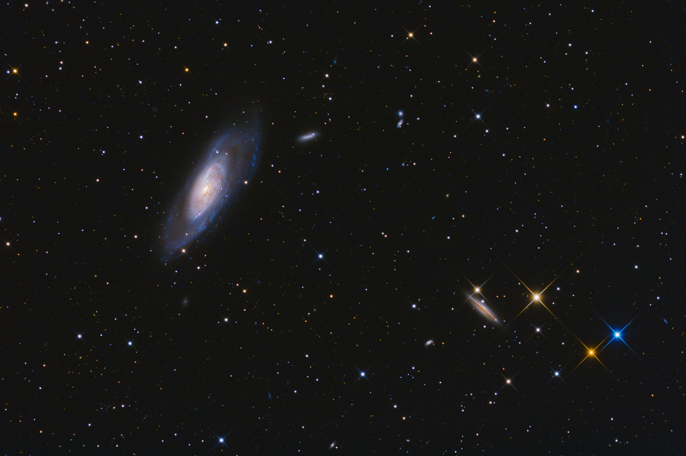
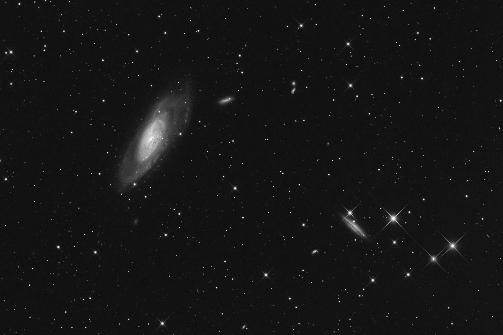

# GrayScaling

## Introduction

Given a buffered image, it'll **concurrently** process each row of image & 
obtain mean of pixel intensities for each pixel location, which is to 
be stored in sink image _( other than original )_.

## Usage

- Code for converting an image to grayscale image, although a grayscale image can be
gray scaled too without any harm, but that's nothing but waste of computation

```java
import in.itzmeanjan.filterit.GrayScale;
import in.itzmeanjan.filterit.ImportExportImage;


public class Main{

	public static void main(String [] args){
		System.out.println(
            ImportExportImage.exportImage(
                new GrayScale().grayscale("galaxy.jpg"), 
                "grayscale.jpg"));
	}

}
```

- Compile & run it _( make sure you've downloaded compiled jar for filterIt )_

```bash
$ javac -cp ".:in.itzmeanjan.filterit.jar" Main.java
$ java -cp ".:in.itzmeanjan.filterit.jar" Main
```

- Here's your result

## Results

Original | GrayScaled
--- | ---
 | 
 | 
