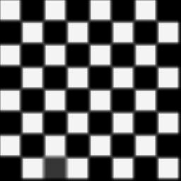
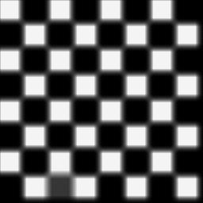

# Mean Filter

## Introduction

Given an image, we'll apply a mask/ kernel of order-X _( of (2x+1) x (2x+1) dimension )_
on each pixel of image & keep putting mean of pixel intensities from its neighborhood, at each I(x, y).

## Performance

- First I was processing each image pixel concurrently. Then applying order-5 Mean Filter on an image of dimension 3200x1907,
took ~2 min.


- Now it has been improved, processing each row of image matrix concurrently. In previous case it was not doing that much work in each worker thread, but more works thrown at thread pool.
Which has been drastically reduced with introduction of row based concurrent processing. Now it took ~14s, which is almost **8x** improvement.


**Improvement will be clearer with processing of larger images.**

### Testing

Performance testing done on an image of dimension 3200x1907, by applying **Mean Filter** of order-5.

Source | Sink
--- | ---
 | 

## Usage

- Put below code snippet in Java source file.

```java
import in.itzmeanjan.filterit.ImportExportImage;
import in.itzmeanjan.filterit.filter.MeanFilter;


public class Main{

	public static void main(String [] args){
		System.out.println(
            ImportExportImage.exportImage(
                new MeanFilter().filter("bridge.jpg", 5), 
                "meanFiltered.jpg"));
	}

}
```

- Compile and run project, make sure you before that you add `in.itzmeanjan.filterit.jar` as your project dependency.

## Results

Order of Filter | Image
--- | ---
0 | 
1 | 
2 | 
3 | 
4 | 
5 | 
