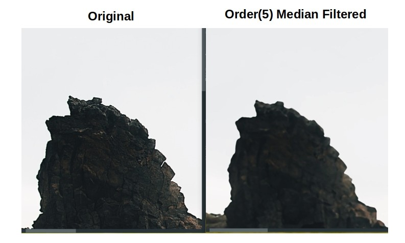

# Median Filter



## Introduction

Given an image, we'll update each pixel intensity by 

- Taking all pixels present in specified proximity _( by order of neighborhood )_ of pixel P[x, y]
- Then computing their mean intensity, and putting it in P[x, y]

Well, we can compute median filtered image by sequentially processing each pixel of image, I. But that's gonna take a lot of time for images with higher resolution and/ or high order of filtering value.

So, we'll rather go for another solution - **compute concurrently**.

- [i] Process each pixel of image concurrently
- [ii] Process each row/ column of image matrix concurrently

*Now concurrent processing can be done either by using explicit thread(s) for each job/ thread pool by scheduling submitted jobs.*

But I'd like to choose **[ii]**. Here's why ?

- Here we'll be required to create/ schedule lesser number of workers
- Each worker will do a substantial amount of job
- In first case, each worker does a very small portion of total work, but we end up scheduling a lot of jobs, which eventually increases waiting time.

Current median filter implementation based on choice **[ii]**.

## Usage

- Copy below code snippet into Java source code file.

```java
import in.itzmeanjan.filterit.ImportExportImage;
import in.itzmeanjan.filterit.filter.MedianFilter;


public class Main{

	public static void main(String [] args){
		System.out.println(
            ImportExportImage.exportImage(
                new MedianFilter().filter("sea.jpg", 1), 
                "medianFiltered.jpg"));
	}

}
```

- Make sure you've added `in.itzmeanjan.filterit.jar` as your project dependency.
- Now compile & run.

## Results

Order-0 image is original one.

Order | Image
--- | ---
0 | 
1 | 
2 | 
3 | 
4 | 
5 | 

