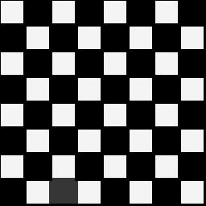

# Min Filter

## Introduction

Given an image, we'll replace each pixel intensity with minimum value
from its neighbouring pixels, where order of neighbourhood can be variable X _( > 0)_.

## Performance

- Prior to this writing, I wrote concurrent MinFilter implementation where
each pixel was getting processed in different worker thread 
_( depending upon availability in thread pool )_.
- Now implementation has been improved by processing each row of image matrix concurrently.
- Previously each thread was doing little work, but for large images _( & for higher order filtering )_ 
communication cost _( work distribution )_ was too high due to presence of large number of pixels in image.
- So, I considered reducing number of works created, by processing each row concurrently on possibly different worker threads.
- Check below for performance improvement, due to updating implementation

### Sample

I applied both MinFilter implementations on sample of dimension _2560 x 1440_, with order value set to **5**.

Source | Sink
--- | ---
 | 

### Before

### After

## Results

All filters applied on order-0 image.

Order | Image
--- | ---
0 | 
1 | 
2 | 
3 | 
4 | 
5 | 

Thanking you :blush:
