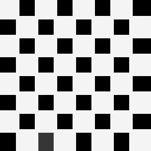
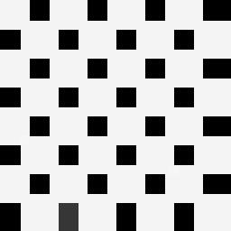

# Mode Filter

## Introduction

Given an image & order *( > 0 )*, we'll compute max intensity around each pixel location, 
and replace intensity at that location in sink image, with computed max intensity.

## Performance

While incorporating concurrency in generalized Mode Filter, I was processing each pixel location concurrently,
which was adding cost to computation time _( due to increased communication needed to be made while job 
scheduling, for very large images )_.

So, I've improved it by concurrently processing each row of image matrix. Here's result.

### Before


### After


### Test

I've tested both the implementations 
_( specified above )_ on a _1920 x 1275_ image *( left image )*.

Source | Sink
--- | ---
 | 

## Usage

- Code for applying order-3 Mode Filter on an image

```java
import in.itzmeanjan.filterit.ImportExportImage;
import in.itzmeanjan.filterit.filter.ModeFilter;


public class Main{

	public static void main(String [] args){
		System.out.println(
            ImportExportImage.exportImage(
                new ModeFilter().filter("dream.jpg", 3), "modeFiltered.jpg"));
	}

}
```

- Compile & run *( make sure you've added `in.itzmeanjan.filterit.jar` in your project )*

## Results

_All filters applied on order-0 image._

Order | Image
--- | ---
0 | 
1 | 
2 | 
3 | 
4 | 
5 | 
