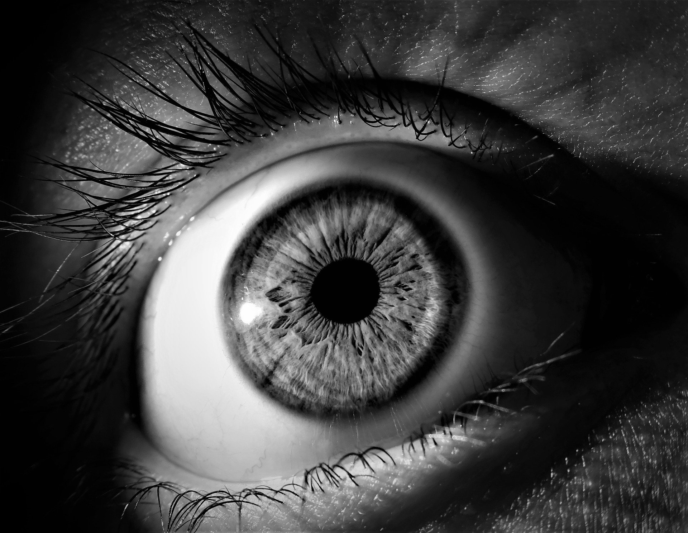

# Image Smoothing - Opening


## Introduction

Image smoothing can be performed by application of morphological operations in ordered fashion.

- First erode image
- Then dilate it

**Image gets smoothed by removing bright pixels.**

Size of structuring element i.e. order of kernel to be used Erosion & Dilation,
can be specified, which will control extent of smoothing.

## Usage

- Put this code snippet into Java source file.

```java
import in.itzmeanjan.filterit.ImportExportImage;
import in.itzmeanjan.filterit.smoothing.Opening;

public class Main{

	public static void main(String [] args){
		System.out.println(
            ImportExportImage.exportImage(
                new Opening().smooth("eye.jpg", 5, 5), 
                "opened.jpg"));
	}

}
```

- Compile & run, make sure you've added `in.itzmeanjan.filterit.jar` as your project dependency.

## Result

Original | Smoothed
--- | ---
 | 

Thanking you :)
