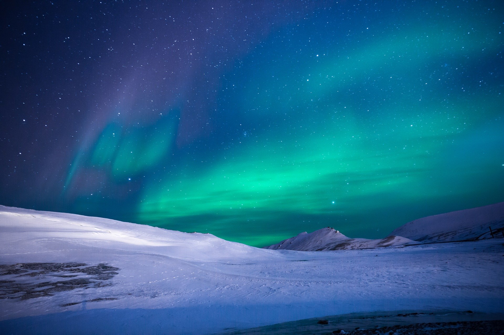
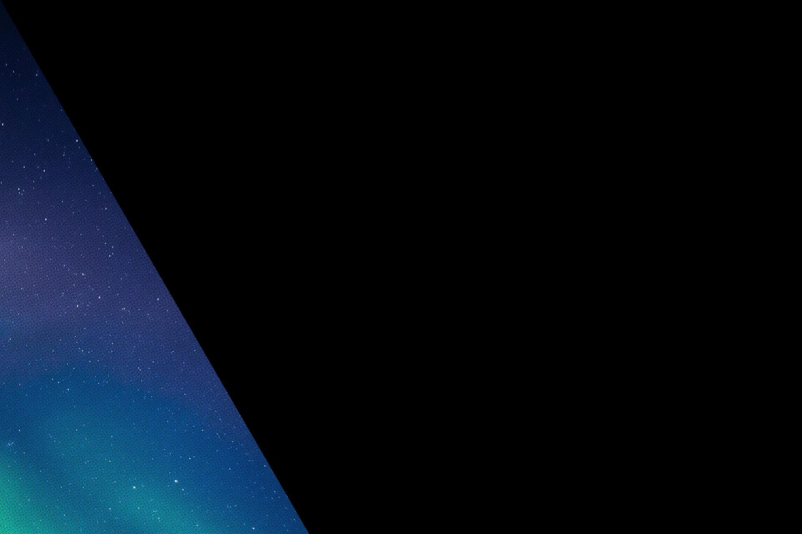
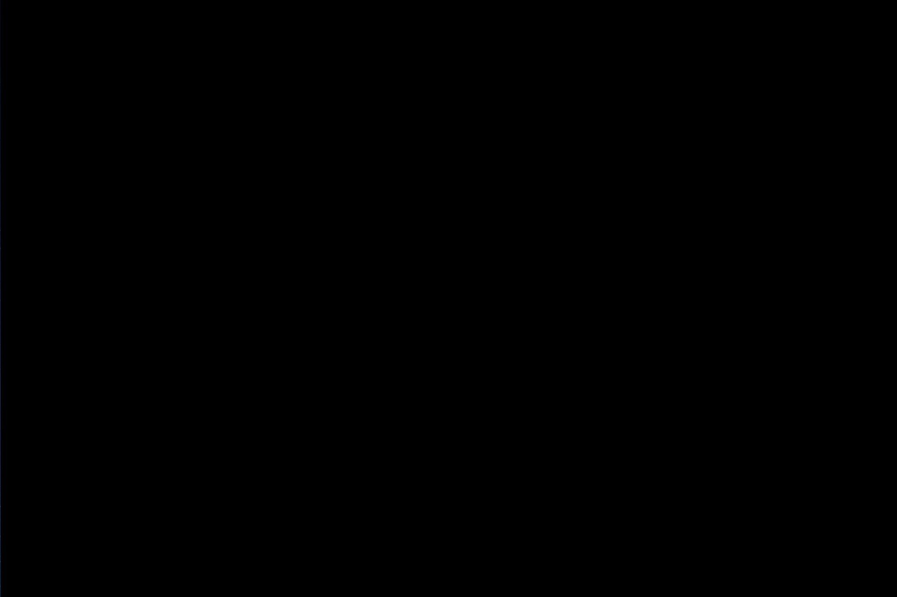
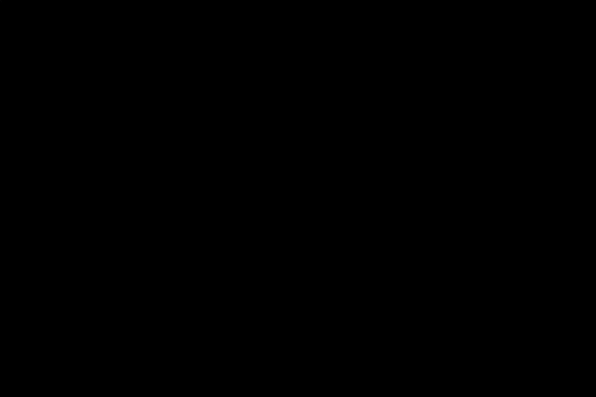
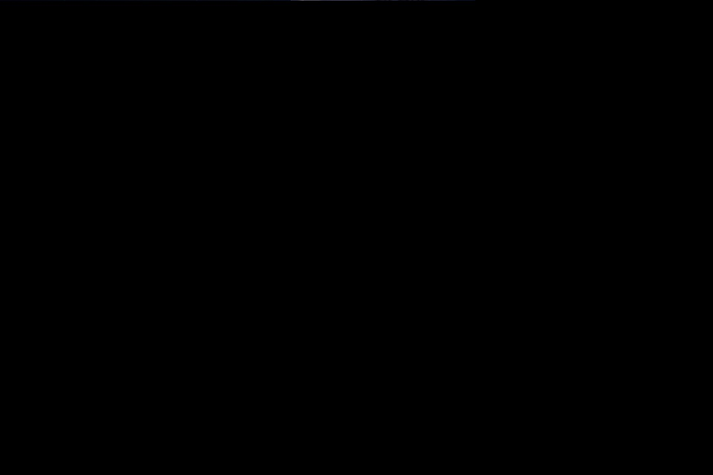
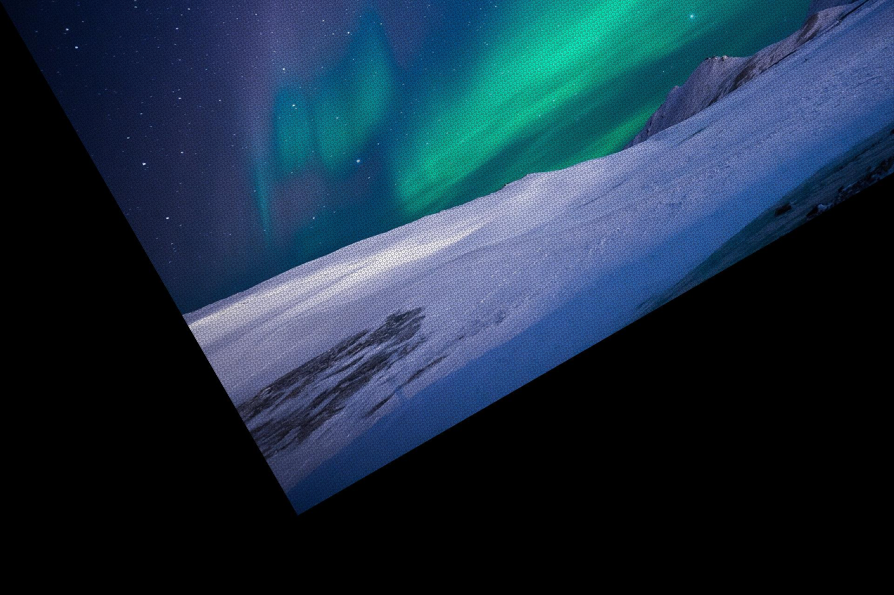
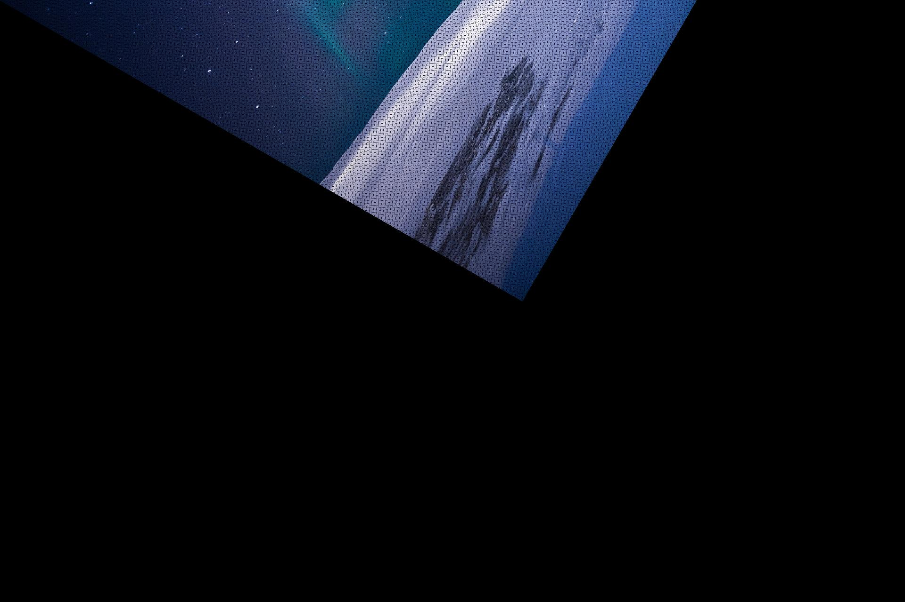
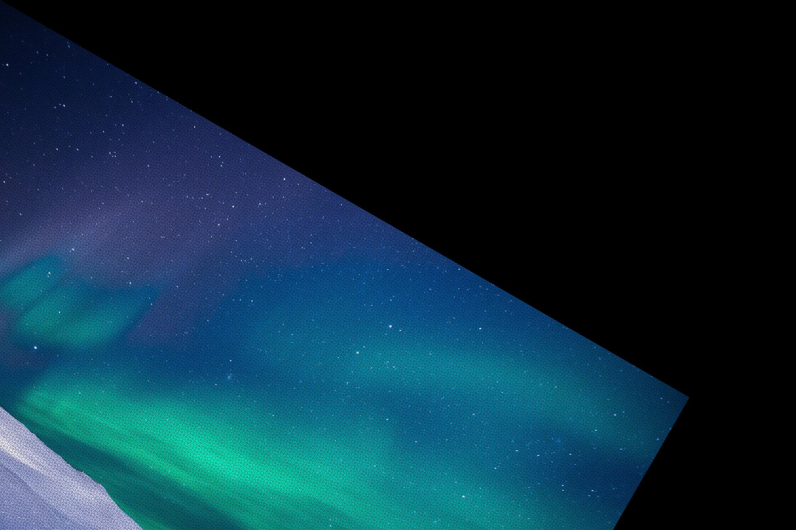

# Rotation

## Introduction

Given a buffered image, we'll rotate
each pixel P[x, y] such that even after rotation,
rotated pixels will be on same line as they
were before rotation i.e. lets take a set of pixels
lying on straight line before rotation and after rotation
you'll notice those same pixels are on straight line, 
just position has changed.

## Results

### Clockwise Rotation

Angle of Rotation | Image
--- | ---
0° | 
-30° | 
-60° | 
-90° | 
-120° | 
-150° | 
-180° | 
-210° | 
-240° | 
-270° | 
-300° | 
-330° | 
-360° | 

### AntiClockwise Rotation

Angle of Rotation | Image
--- | ---
0° | 
30° | 
60° | 
90° | 
120° | 
150° | 
180° | 
210° | 
240° | 
270° | 
300° | 
330° | 
360° | 

Thanking you :wink:
