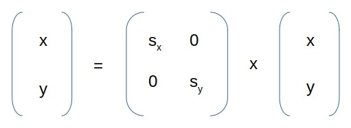

# Scaling

## Introduction

Given an image, each pixel of that needs to be scaled
along X and Y axis as per given scale factor _( which is
a floating-point value != 0.0 )_, so that pixels
stay on same straight line even after scaling. That's
one of the _affine transformation_ operations that
can be preformed on images.

Each pixel of source image to be relocated to
a new position in sink image, using following formula.



_where Sx & Sy is horizontal & vertical scale factors, respectively_

One thing can be observed, resulting pixel location
may not be always integer _( depends upon value of scale factors )_,
which needs us to convert it to some valid integer pixel
location in sink image. We'll go for simple
rounding method.

## Usage

- Make sure you've `in.itzmeanjan.filterit.jar` in current project
directory

- Type in following code snippet in to `Main.java`.

```java
import in.itzmeanjan.filterit.ImportExportImage;
import in.itzmeanjan.filterit.affine.Scale;

public class Main {

    public static void main(String[] args) {
        Scale scale = new Scale();
        System.out.println(ImportExportImage.exportImage(
                scale.scale("butterfly.jpg", 1.25, 1.25),
                "scaledX1_25Y1_25.jpg"
        ));
    }
}
```

- Compile it using following bash command

```bash
$ javac -cp ".:in.itzmeanjan.filterit.jar" Main.java
```

- Run it using bash snippet below

```bash
$ java -cp ".:in.itzmeanjan.filterit.jar" Main
```

- And here's result.

## Results

Source | Scale factor X | Scale factor Y | Sink
--- | --- | --- | ---
 | 1.25 | 1.25 | 
 | 1.75 | 1.25 | 
 | 2.0 | 2.0 | 

Thanking you :blush:
