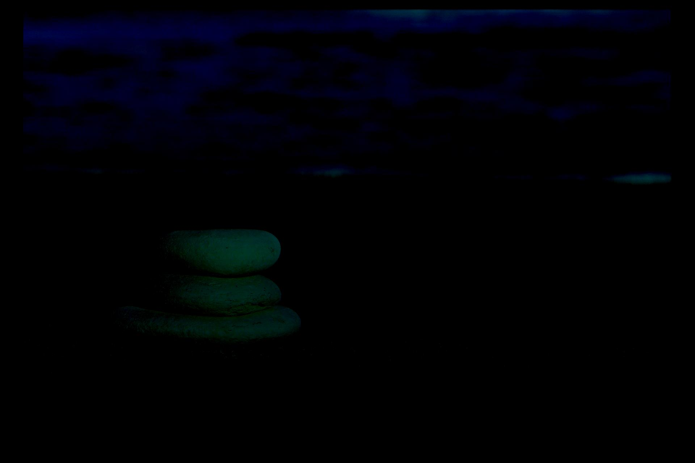
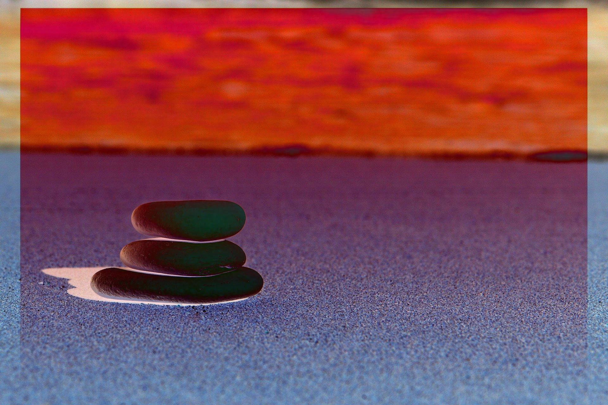
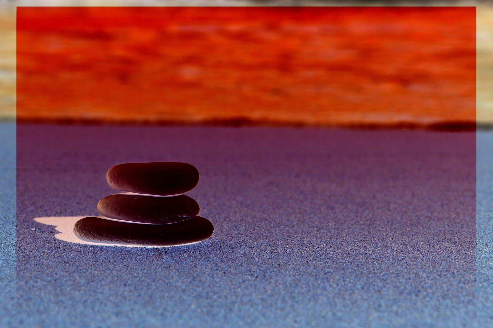

# Subtraction Operator

## Original Images ( Operands )

Image 1 | Image 2
--- | --- |
 | 

## Details

_Performs **subtraction** operation on two pixel intensities ( from two different images ), not **difference** operation i.e. absolute subtraction, so putting operand images in different order may result into different images_

**Image_1 - Image_2 != Image_2 - Image_1**

It's pretty evident that after application of subtraction operator on two equal sized images, resulting pixel intensity values may be out of range _( > 255 )_, which can't be stored in a 24-bit RGB image. For putting pixel intensities in [0, 255] range, we can consider either of following two ways

- All pixel intensities < 0, becomes 0 and > 255, becomes 255. **[ Clipping ]** _( Produces different result depending upon operand placement )_
- We'll simply apply modulus _( % )_ 256, to put all pixel intensities back to range. **[ Scaling ]**.

It doesn't matter how you place operands, when you want to scale pixel intensities, because before scaling pixel intensity absolute value to be taken only.

- abs( 257 ) % 256 = 1
- abs( -257 ) % 256 = 1, both boils down to same value. 

## Resulting Image = Image_1 - Image_2

Clipped | Scaled 
--- | ---
 | 

## Resulting Image = Image_2 - Image_1

Clipped | Scaled 
--- | ---
 | 
