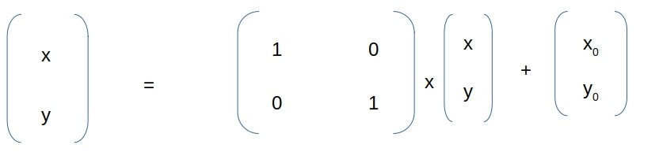

# Translation

## Introduction

Given a buffered image, we'll translate each pixel P[x, y] into
a new location in destination image, by required positions
along X-axis or Y-axis or both.

## Results

Original | Translated | X | Y
--- | --- | --- | ---
 |  | 500 | 250

Thanking you :blush:
